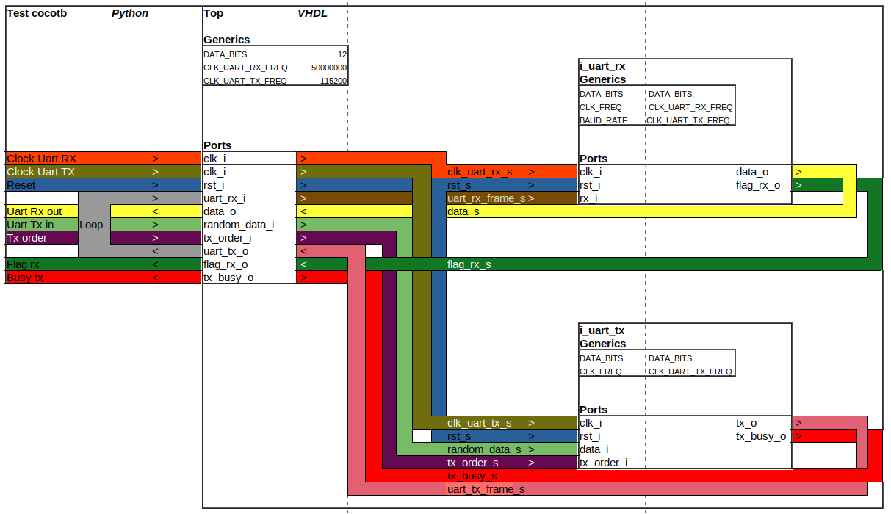
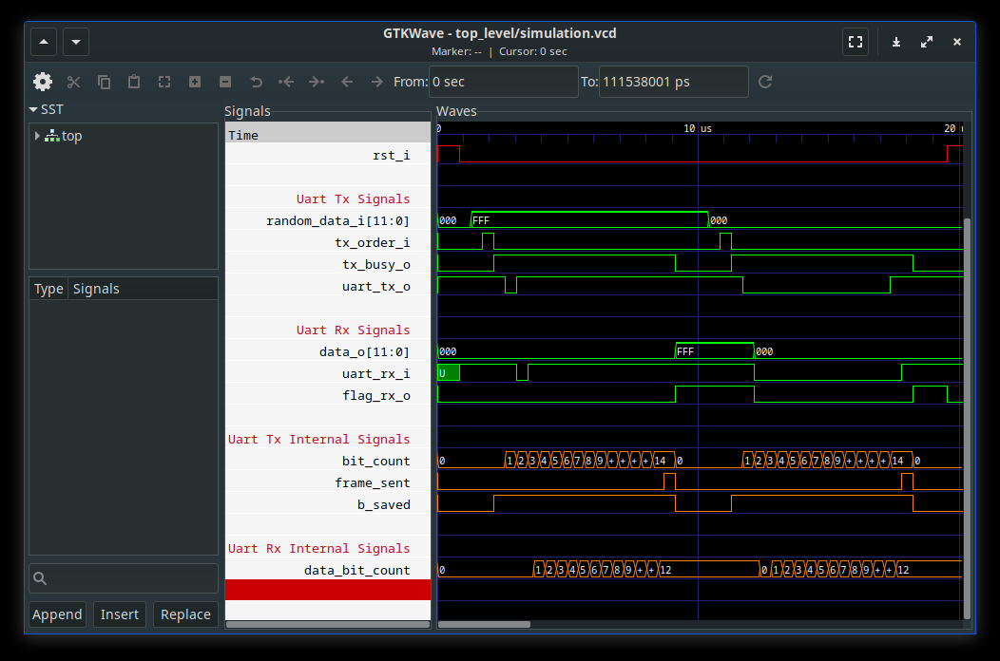

# Test report : Uart Tx component

## 1 - RTL architecture

### a. Ports and components

  

### b. Behavior

Previously seen `uart_rx` and `uart_tx` component are instanciated in a `top_level` architecture. Data is sent to `uart_tx` which itself send a frame toward `uart_tx_o` output.

In cocotb `uart_tx_o` output is delayed and looped onto `uart_rx_i` input. 

Therefore `uart_rx` component receives the frame and decode the data which is then display on the `data_o` port.

## 2 - Tests description :

## a. Sending 2 trivial frames

### Test description
Sets 0x000 and 0xFFF as input of Tx component.  

Frame sent by `uart_tx` component is looped onto the input of `uart_rx` component.

Validates the coherence of the Rx component data output.

**function: uart_top_looping_two_frames_trivial_data**

### Test plot

### Test validation

## b. Sending 10 random frames

### Test description
Sets ten frames with random data as input of Tx component.  

Frame sent by `uart_tx` component is looped onto the input of `uart_rx` component.  

Validates the coherence of the Rx component data output.

**function: uart_top_looping_ten_frames_random_data**

### Test plot

### Test validation

