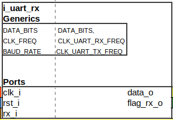
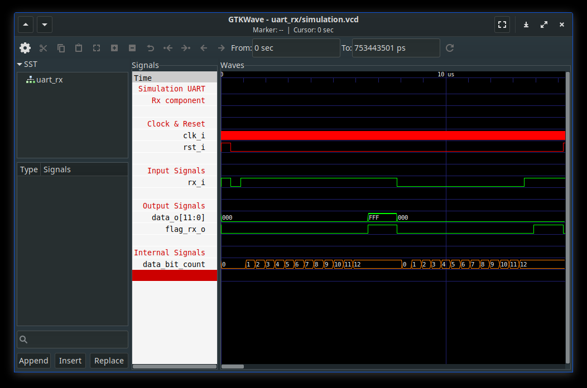
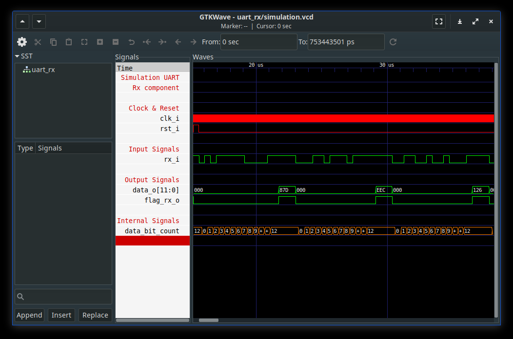

# Test report : Uart Rx component

## 1 - Component description

### a. Ports

| Port       | i/o | Type                                    | Purpose                         |
|:-----------|:---:|:---------------------------------------:|:-------------------------------:|
| clk_i      | in  | std_logc                                | Clock                           |
| rst_i      | in  | std_logic                               | Reset                           |
| rx_i       | in  | std_logic                               | Uart Frame input                |
| data_o     | out | std_logic_vector((DATA_BITS-1) downto 0)| Data received within UART frame |
| flag_rx_o  | out | std_logic| New data has been received   | New data has been received      |  

### b. Behavior

UART frame is received bit by bit on `rx_i` port.  
Frame is defined as [START; DATA[0:DATA_BITS]; STOP].  
(START, STOP) values are defined as (0, 1).  
`rx_i` idle is '1', it recognise a new frame when it receives '0' ic, START.  
When all frame has been received `flag_rx_o` is pulled up to '1' and data can be read.  

## 2 - Tests description

## a. get_two_frames_trivial_data()

### Test description
Rx component receives frames as input with 0x000 and 0xFFF as data.  
Validates that `data_o` state is 0x000 and 0xFFF.

### Test plot

  

### Test validation

## b. get_hundred_frames_random_data()

### Test description
Rx component receives hundred frames as input with random data.  
Validates that `data_o` state is coherent with input frame.

### Test plot

  

### Test validation
