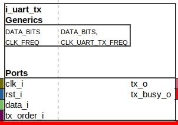
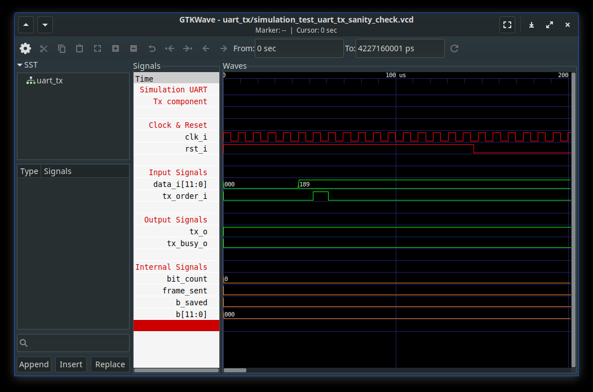
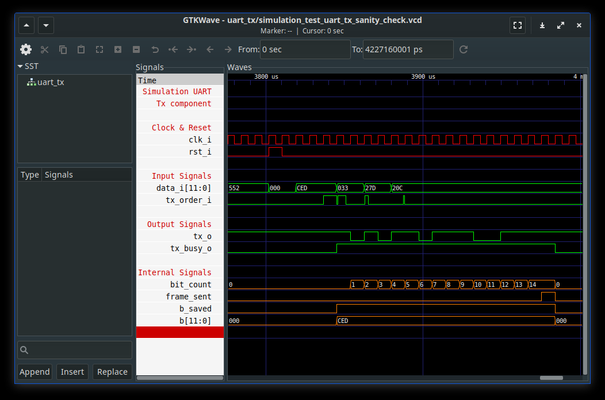
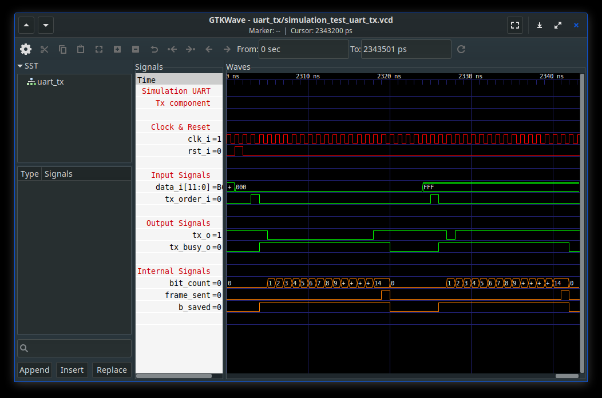
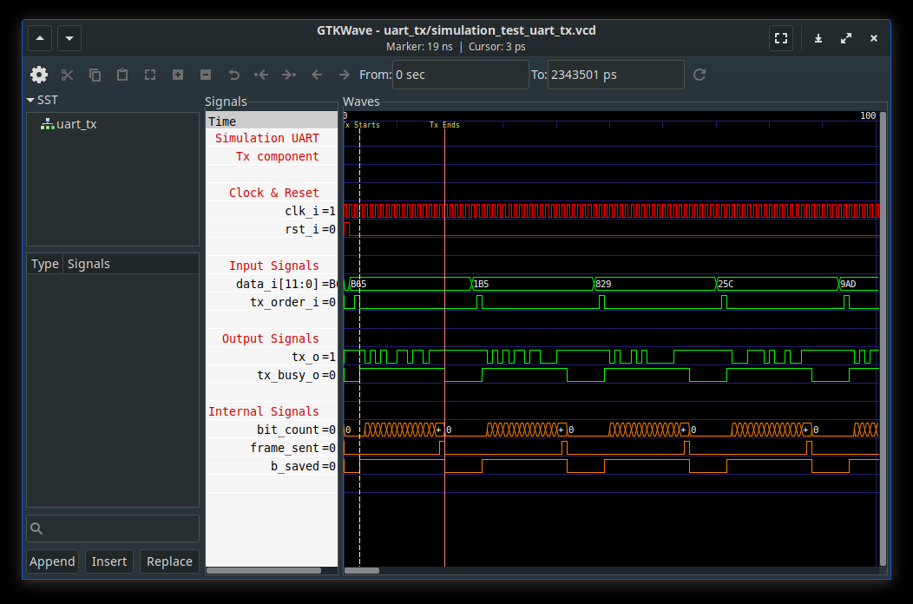

# Test report : Uart Tx component

## 1 - Component description

### a. Ports

| Port       | i/o | Purpose                                  |                                |
|:-----------|:---:|:----------------------------------------:|:------------------------------:|
| clk_i      | in  | std_logic                                | Clock                          |
| rst_i      | in  | std_logic                                | Reset                          |
| data_i     | in  | std_logic_vector((DATA_BITS-1) downto 0) | Data to send within UART frame |
| tx_order_i | in  | std_logic                                | Tx order                       | 
| tx_o       | out | std_logic                                | Uart Frame output              |
| tx_busy_o  | out | std_logic                                | Component is busy sending      |

### b. Behavior

Data to embbed in UART frame is set as input of component on `data_i` port. 
Setting '1' on `tx_order_i` starts the communication on the `tx_o` port.
Frame is defined as [START; DATA[0:DATA_BITS]; STOP].   
(START, STOP) values are defined as (0, 1).  
`tx_o` idle is '1', sending a new frame modifies it to '0' ic, START. 
While frame is being sent `tx_busy_o` is set to '1'.
When all frame has been sent `tx_busy_o` is pulled down to '0' and new data can be sent.  

## 2 - Tests description :

## a. Sanity check : Late reset

### Test description
Sends tx order signal before reset.  
Validates that Tx doesn't happen while reset is up.  

**function: test_uart_tx_sanity_check.late_reset()**

### Test plot

  

## b. Sanity check : Tx order while busy

### Test description
Sends random tx orders signal while uart is busy.  
Validates that component isn't altered if component receives a new tx order :
- bit count doesn't reset  
- data value isn't modified

**function: test_uart_tx_sanity_check.test_tx_order_while_busy()**

### Test plot

## c. Sending 2 trivial frames

### Test description
Sets 0x000 and 0xFFF as input of Tx component.  
Validates the coherence of the UART frame output.

**function: test_uart_tx.send_two_frames_trivial_data**

### Test plot

### Test validation

## d. Sending 100 random frames

### Test description
Sets hundred of frames with random data as input of Tx component.  
Validates the coherence of the UART frame output.

**function: test_uart_tx.send_hundred_frames_random_data**

### Test plot

## Test validation

 

